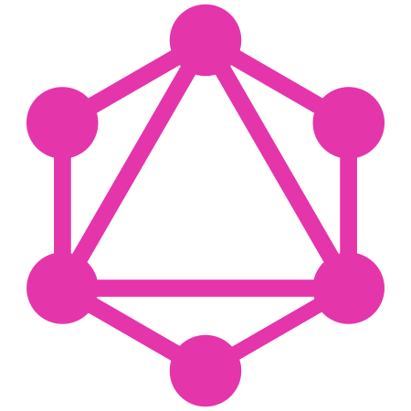
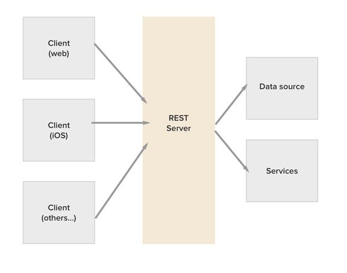
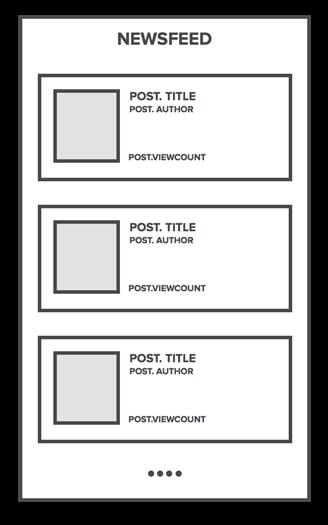
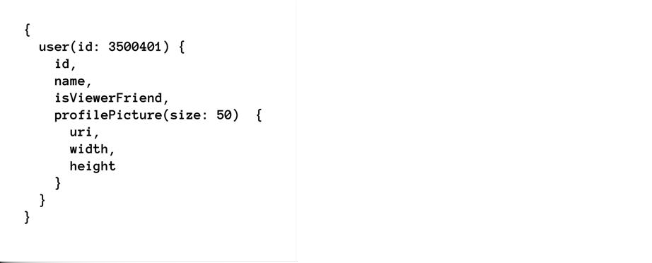
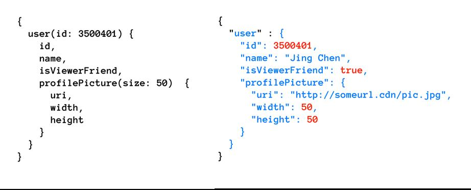

class: center, middle

# Introduction  to GraphQL


---

# What it's all about ?

* What is GraphQL ?

* Why GraphQL ?
    * Problems with REST
    * How GraphQL solves these problems

* A simple GraphQL server

* Who is using it ?

---

class: center, middle

# NOTE

GraphQL is not a Database like SQL Server, MySQL os PostgresQL.

---

class: center, middle

# NOTE

GraphQL is not a database query language like SQL.

---


# What is GraphQl ?

In a nutshell, GraphQL is a syntax that describes how to ask for data,
and is generally used to load data from a server to a client.

???
GraphQL is a query language for your API, and a server-side runtime for executing queries by using a type system you define for your data. GraphQL isn't tied to any specific database or storage engine and is instead backed by your existing code and data.

---


# What is GraphQl ?

In a nutshell, GraphQL is a syntax that describes how to ask for data,
and is generally used to load data from a server to a client.

It’s an application layer query language that you can use with any backend 
Example — SQL, MongoDB, Redis, etc.

???
GraphQL is a query language for your API, and a server-side runtime for executing queries by using a type system you define for your data. GraphQL isn't tied to any specific database or storage engine and is instead backed by your existing code and data.

---

# What is GraphQl ?

In a nutshell, GraphQL is a syntax that describes how to ask for data,
and is generally used to load data from a server to a client.

It’s an application layer query language that you can use with any backend 
Example — SQL, MongoDB, Redis, etc.

Open Source

???
GraphQL is a query language for your API, and a server-side runtime for executing queries by using a type system you define for your data. GraphQL isn't tied to any specific database or storage engine and is instead backed by your existing code and data.

---

# What is GraphQl ?

In a nutshell, GraphQL is a syntax that describes how to ask for data,
and is generally used to load data from a server to a client.

It’s an application layer query language that you can use with any backend 
Example — SQL, MongoDB, Redis, etc.

Open Source

Created by Facebook

???
GraphQL is a query language for your API, and a server-side runtime for executing queries by using a type system you define for your data. GraphQL isn't tied to any specific database or storage engine and is instead backed by your existing code and data.

---

# What is GraphQl ?

In a nutshell, GraphQL is a syntax that describes how to ask for data,
and is generally used to load data from a server to a client.

It’s an application layer query language that you can use with any backend 
Example — SQL, MongoDB, Redis, etc.

Open Source

Created by Facebook

An Query language for you APIs

???
GraphQL is a query language for your API, and a server-side runtime for executing queries by using a type system you define for your data. GraphQL isn't tied to any specific database or storage engine and is instead backed by your existing code and data.

---

# Why GraphQL ?

 Typical Architecture of REST APIs



---

# Why GraphQL ?

Problems with rest APIS

* Multiple round trips

* Over-fetching data


---

# A news feed example



---

# A news feed example

Two Resources

* Users

* Posts

---

# A news feed example

A REST API for it

```

POST /posts
GET /posts/limit
DELETE /posts/postId

...

POST /users
GET /users/limit
DELETE /users/userId


```
---

# A news feed example

JSON response for query `Get /posts?limit=10`

```
{
    "posts" : [
        {
            "id" : 1,
            "title" : "hello world"
            "author_id" : 29,
            "likedCount" : 3,
            "likedBy" : [1 ,3]
        },
        ...
        ...
    ]
}

```

Wait! we need authors name name avatar url

---

# A news feed example


`Get /posts?limit=10`
`Get /users/limit=10`

```
{
    "users" : [
        {
            "id" : 1,
            "name" : "Finn Jones"
            "handle" : "ironfist,
            "age" : 29,
            "avatar_url" : "/avatar/url.jpg"
        },
        ...
        ...
    ]
}

```

So make another request to get authors.
Wait! that is not in list.

---

# A news feed example


`Get /posts?limit=10`

`Get /users/limit=30`

```
{
    "users" : [
        ...
        ...
        {
            "id" : 30,
            "name" : "Thomas Grant Gustin"
            "handle" : "flash,
            "age" : 27,
            "avatar_url" : "/avatar/url.jpg"
        }
    ]
}

```

So increase the limit.

Great!

But wait !!!


---

# A news feed example

* We have to do a seperate request for each post to get information about it other  (**Multiple Round trips**)

* We are interestd only in `name` and `avatar` still get other fields (**Overfetching data**)


        Hhnnggghhh 😖

---

# A news feed example

Common approaches to work around these issues

* Have GET /users to accept array of ids
    * GET /users/?ids=[1,2,3,4]

* Accept params to specify fields to return
    * GET /users?fields=['id', 'name', ...]&ids=[]

* Create an additional custom-endpoints
    * GET /newsfeed.

    * But it's tightly coupled to your client UI.


---

# A news feed example

How does GraphQL address these issues ?

Here is and example query and it's response




---

# A news feed example

How does GraphQL address these issues ?

Here is and example query and it's response


**Ask for what you need, get exactly that**

---

# GraphQl Componets

* **Schema**
* **Query**
* **Mutations**
* **Fields**
* **Argument**


---

# GraphQl Componets

* **Schema**

    Every graphql server defines a set of types which describe the set of possible data you can query from that server.

---

# GraphQl Componets

* **Query**

    Queris are to fetch data from server. It typicaly contain two things

    1. Feilds
    2. Argument

    ```
    {
     hero (id: 123){
            name
            friends {
                name
            }
        }
    }
    ```
---

# GraphQl Componets

* **Mutations**

    Mutations are to modify the data on server.

---

# Advantages

* More Elegant Data Retrieval

* Better Query Efficiency

* Only one endpoint

* Type safety

    ...

    ...


---

# DEMO


---

# Who are using it ?

Well, It's not even possible to list all organizations who have adapted GraphQl.

Some of the name's are

    * Facebook ( obviously )
    * Github
    * Coursera
    * Myntra
    * pinterest
    * and many more ...


A full list of GraphQl users is available at http://graphql.org/users/


---
class: center, middle

# Thank You


